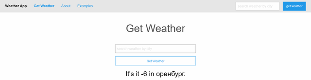
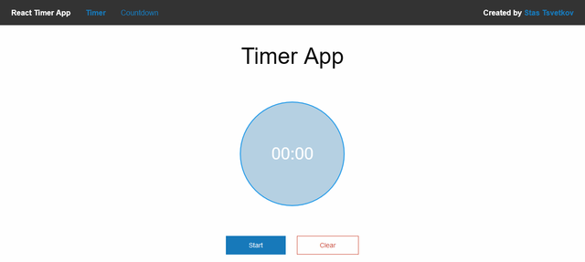
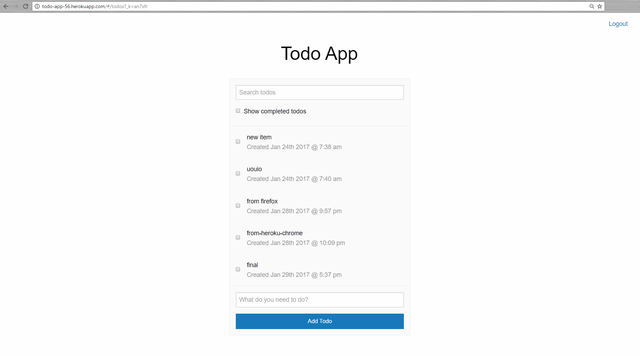

### A weather application

 - **** Получение и вывод погоды, используя открытый [API](http://openweathermap.org)

#### Запуск
1. сборка проекта `webpack -w`
2. запуск сервера `node server.js`

#### Посмотреть демо
* [Weather-app](http://weather-app-56.herokuapp.com/)

-------------------------------------------------------
-------------------------------------------------------

### A timer application

 - **** Секундомер, и таймер обратного отсчёта

#### Запуск
1. сборка проекта `webpack -w`
2. запуск сервера `node server.js`

#### Посмотреть демо
* [Timer-app](http://weather-app-56.herokuapp.com/)

-------------------------------------------------------
-------------------------------------------------------

### A todo application

 - **** Список дел, с авторизацией через github и firebase, в качестве бд.

#### Запуск
1. сборка проекта `webpack -w`
2. запуск сервера `node server.js`

#### Посмотреть демо
* [Todo-app](http://todo-app-56.herokuapp.com/)

 
#### Предложения
https://bitbucket.org/stasok/react-complete/pull-requests/ - Ваши пожелания и замечания к проекту.